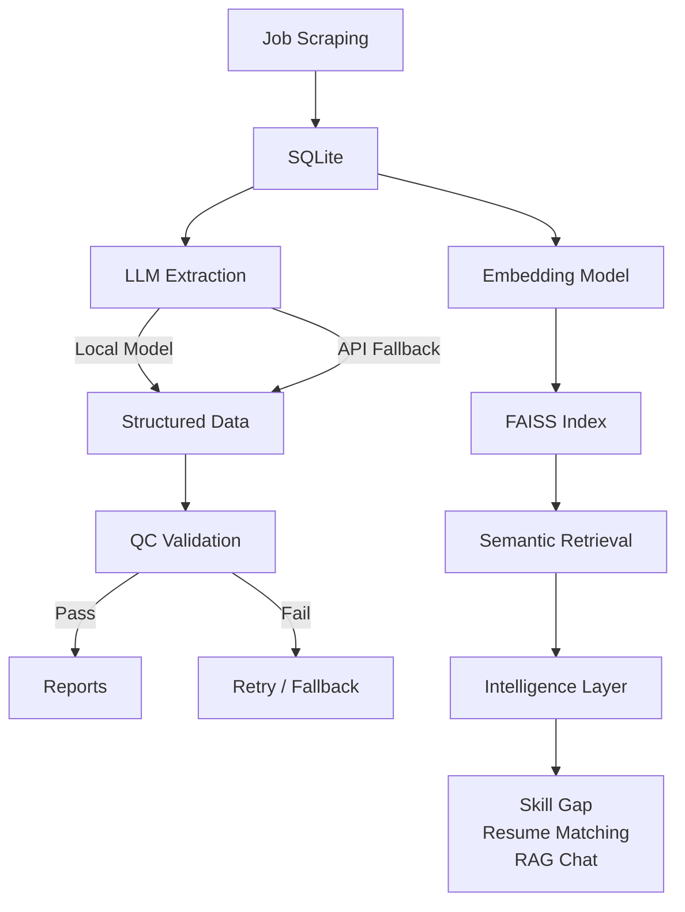

# JobPulse

> **From raw job postings → structured intelligence → personalized career decisions.**

JobPulse is a **production-grade LLM system** that transforms unstructured job data into:

- 📊 structured job intelligence
- 🔍 semantic search & retrieval
- 🧠 personalized career insights

It demonstrates how modern AI systems are actually built in production:

> **LLM pipelines + retrieval systems + user-facing intelligence layer**

------

# 🌐 Live Demo

👉 https://jobspulse.org/

**Status:** Auto-updating every 6 hours
**Stack:** Full pipeline + RAG + UI deployed

------

# ✨ Why JobPulse Exists

Most job platforms (LinkedIn, Indeed):

- ❌ keyword search only
- ❌ no understanding of candidates
- ❌ no reasoning about fit

JobPulse changes the paradigm:

> **Search → Understanding → Intelligence**

It doesn’t just list jobs —
it **reasons about them and about you**.

------

# 🧠 What Makes JobPulse Different

## 1. Structured Understanding (Not Just Text)

```text
raw job description
→ LLM extraction
→ structured schema
→ validated output
```

Every job becomes machine-readable intelligence:

- skills
- requirements
- experience levels
- responsibilities

------

## 2. Retrieval System (RAG Core)

```text
job data
→ embeddings
→ FAISS index
→ semantic retrieval
```

Used for:

- job search
- resume matching
- career insights
- chat interface

------

## 3. Career Intelligence Layer ⭐

This is where JobPulse becomes **a product, not just a pipeline**.

------

### 🔍 Resume → Job Matching

```text
resume
→ skill extraction
→ embedding query
→ FAISS search
→ ranking + reasoning
```

Outputs:

- best matching jobs
- shared skills
- missing skills
- explainable reasoning

------

### 🧠 Skill Gap Analyzer

```text
resume vs job
→ skill diff
→ gap detection
→ recommendations
```

Gives:

- what you're missing
- what to learn next
- how far you are from a role

------

### 💬 RAG Career Chat

```text
user question
→ vector retrieval
→ context injection
→ LLM reasoning
```

Ask things like:

- “What skills am I missing for ML roles?”
- “Which jobs fit my background best?”
- “What are my risks for this role?”

------

# 🏗 System Architecture



------

# 🔁 End-to-End Flow

```text
Scraping
→ Extraction
→ QC Validation
→ Embeddings
→ Retrieval
→ Intelligence Layer
→ User Insights
```

------

# ⚙️ Pipeline (Production Style)

### Automated every 6 hours:

```text
scrape jobs
→ update DB
→ build embeddings
→ rebuild FAISS index
```

------

### Core scripts

| Step          | Script                  |
| ------------- | ----------------------- |
| Scraping      | `run_pipeline.py`       |
| Embedding     | `build_vector_index.py` |
| Orchestration | `daily_update.py`       |

------

# 🤖 LangGraph Orchestration

Core workflow:

```text
fetch → extract → qc → report → finalize
```

Features:

- local-first routing
- automatic API fallback
- retry logic
- structured state

------

# 🛡 Reliability Design (Real Production Pattern)

## Local-first Inference

```text
local model
→ QC
→ fallback API
```

------

## QC Validation Gate

- required fields
- non-empty values
- schema validation
- JSON correctness

------

## JSON Hardening

- repair malformed outputs
- recover partial generations
- sanitize tokens

------

# 📊 Observability (Underrated but Critical)

Each run produces:

```text
structured.json
qc.json
trace.json
report.md
run_summary.json
```

Stored in:

```
data/artifacts/
```

This enables:

- debugging
- reproducibility
- auditability

------

# 🔍 Vector Search

```text
query
→ embedding
→ similarity search
→ ranked jobs
```

Backed by:

- FAISS
- dense embeddings

------

# 🧩 Tech Stack

**Core:**

- Python
- HuggingFace Transformers
- PEFT (LoRA)

**LLM Infra:**

- LangGraph
- local + API routing

**Data & Retrieval:**

- FAISS
- SQLite

**Scraping:**

- Playwright

**Infra:**

- Docker
- Nginx
- Cloudflare

------

# 🚀 How to Run

### 1. Install

```bash
uv sync
python -m playwright install --with-deps
```

------

### 2. Run pipeline

```bash
uv run python scripts/run_pipeline.py
```

------

### 3. Build index

```bash
uv run python scripts/build_vector_index.py
```

------

### 4. Run graph

```bash
uv run python scripts/run_graph_one.py --job-id 10704289
```

------

# 🧠 LoRA Fine-Tuning

```bash
uv run python src/training/train_lora.py
```

Improves structured extraction quality.

------

# 🎯 Engineering Highlights

This project demonstrates:

- production-grade LLM pipeline
- retrieval-augmented generation (RAG)
- local-first inference architecture
- structured schema validation
- artifact-based observability
- resume-aware intelligence
- semantic search system

------

# 🔮 Future Work

- incremental embeddings (no full rebuild)
- resume upload UI
- analytics dashboard
- distributed scraping
- monitoring & metrics
- multi-agent orchestration

------

# 🧠 Why This Project Matters

Most systems stop at:

> “Here are some jobs.”

JobPulse goes further:

- understands jobs
- understands candidates
- reasons about alignment

→ turning data into **decisions**

------

# 👤 Ideal Use Cases

- job seekers optimizing applications
- students planning career paths
- AI engineers learning production LLM systems
- recruiters analyzing talent gaps

------

# ⭐ Final Takeaway

JobPulse is not:

- just a scraper
- just a search engine
- just a chatbot

It is:

> **A full-stack AI system for career intelligence**