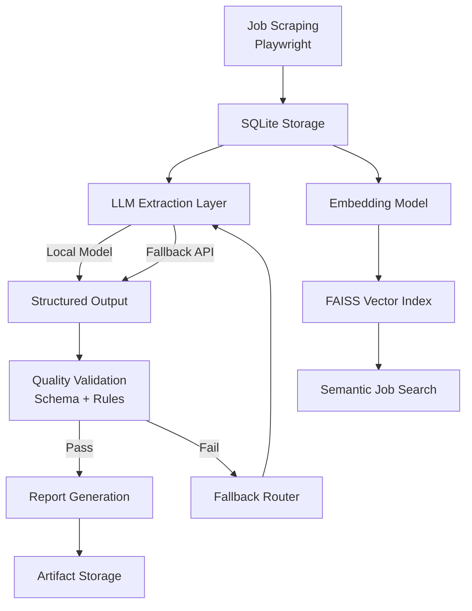

# JobPulse

> **Production-style LLM job intelligence system with automated data pipelines, structured extraction, and artifact-based observability.**

JobPulse is an **end-to-end AI system** that transforms raw job postings into structured intelligence and actionable insights.

The system demonstrates **modern LLM infrastructure patterns**, including:

- local-first model inference
- deterministic fallback to API providers
- structured schema validation
- artifact-based observability
- orchestration with LangGraph
- vector search with embeddings
- automated data pipelines
- containerized deployment

The architecture mirrors how **real production LLM pipelines** are built — prioritizing **reliability, traceability, and reproducibility**.

------

# 🌐 Live Demo

https://jobspulse.org/

System Status: **Auto-updating every 6 hours**

------

# 🚀 What JobPulse Does

JobPulse provides a complete pipeline for **job market intelligence**.

Capabilities include:

- Scraping job postings (Handshake + extensible connectors)
- Extracting structured requirements using LLMs
- Fine-tuning compact models using LoRA
- Validating outputs using quality gates
- Automatic provider fallback (Local → API)
- Generating personalized skill-gap reports
- Semantic job search via vector embeddings
- MCP tool interface for agent integration
- LangGraph orchestration for reliable workflows
# 🏗 System Architecture



🌐 Deployment Architecture

JobPulse runs on a cloud VM using Docker containers, with Cloudflare handling DNS and TLS.

Infrastructure stack:

Component	Technology
Compute	AWS EC2
Containers	Docker
Reverse Proxy	Nginx
Domain & TLS	Cloudflare
Database	SQLite
Scraping	Playwright
Vector Search	FAISS

Architecture:
```bash
Cloudflare
     │
     ▼
   Nginx
     │
     ├── jobpulse-ui container (Streamlit)
     │
     └── jobpulse-api container (FastAPI)
           │
           ├── scraping pipeline
           ├── LLM extraction
           └── vector index builder
```
- The scraping and embedding pipelines run **inside the API container** via scheduled tasks.

  ------

  # ⏱ Automated Data Pipeline

  JobPulse maintains an **automatically updating job dataset**.

  Every update cycle performs:

  ```
  scrape new jobs
  → update SQLite database
  → generate embeddings
  → rebuild vector index
  ```

  This ensures semantic search and analytics operate on **fresh job market data**.
  - # 🔁 Data Pipeline Components

  ## 1️⃣ Scrape Job Postings

  Script:

  ```
  scripts/run_pipeline.py
  ```

  Responsibilities:

  - crawl job listing pages
  - detect new postings
  - extract job descriptions
  - persist data into SQLite

  Output:

  ```
  data/db/jobs.db
  data/artifacts/scrape/<run_id>/
  ```

  Artifacts include:

  ```
  run_summary.json
  trace.json
  config.json
  ```

  ------

  ## 2️⃣ Build Vector Index

  Script:

  ```
  scripts/build_vector_index.py
  ```

  Responsibilities:

  - encode job descriptions using embedding models
  - build FAISS vector index
  - persist vector search store

  Output:

  ```
  data/vectors/
  ```

  ------

  ## 3️⃣ Pipeline Orchestration

  Script:

  ```
  scripts/daily_update.py
  ```

  This script runs the full update sequence:

  ```
  run_pipeline.py
  → build_vector_index.py
  ```

  This file acts as the **entry point for automated data refresh**.

  ------

  # 🤖 Scheduled Updates (Cron)

  The system refreshes job data automatically using **cron + Docker execution**.

  Update frequency:

  ```
  every 6 hours
  ```

  Cron job example:

  ```
  0 */6 * * * flock -n /tmp/jobpulse_daily_update.lock \
  docker exec jobpulse-api sh -lc 'cd /app && python scripts/daily_update.py' \
  >> /home/ubuntu/jobpulse_logs/daily_update.log 2>&1
  ```

  Key features:

  - prevents overlapping executions (`flock`)
  - runs pipeline inside Docker container
  - writes logs to persistent files

  ------

  ## Playwright Execution in Server Environment

  Because Playwright requires a display server, scraping runs using **Xvfb virtual display**:

  ```
  xvfb-run -a python scripts/run_pipeline.py --headed
  ```

  This enables reliable browser automation on headless servers.

  ------

  # 📊 Artifacts & Observability

  Each pipeline run produces artifacts for debugging and traceability.

  Directory structure:

  ```
  data/artifacts/
  
    scrape/<run_id>/
    mcp/<job_id>/
    langgraph/<run_id>/
  ```

  Artifacts include:

  ```
  structured.json
  qc.json
  trace.json
  report.md
  run_summary.json
  config.json
  ```

  ------

  # 📊 Vector Search

  JobPulse supports **semantic job retrieval** using embeddings.

  Pipeline:

  ```
  job descriptions
  → embedding model
  → FAISS index
  → similarity search
  ```

  Vector storage:

  ```
  data/vectors/
  ```

  The vector index is rebuilt after each scraping cycle to ensure consistency.

  Future versions will support **incremental embedding updates**.
  
# 📂 Repository Structure
```bash
.
├── README.md
├── data
│   ├── artifacts
│   │   ├── langgraph
│   │   │   └── ebbe0a0156
│   │   │       └── 10704289
│   │   │           ├── extract_meta.json
│   │   │           ├── qc.json
│   │   │           ├── report.md
│   │   │           ├── report_meta.json
│   │   │           ├── run_summary.json
│   │   │           ├── structured.json
│   │   │           └── trace.json
│   │   ├── mcp
│   │   │   └── 10704289
│   │   │       ├── extract_api_meta.json
│   │   │       ├── fetch.json
│   │   │       ├── qc_api.json
│   │   │       ├── report.md
│   │   │       ├── report_meta.json
│   │   │       ├── run_one_config.json
│   │   │       ├── run_one_summary.json
│   │   │       ├── structured_api.json
│   │   │       └── trace.json
│   │   └── scrape
│   │       └── 252b0c5be9
│   │           ├── bad_samples
│   │           ├── config.json
│   │           ├── fail_samples
│   │           └── run_summary.json
│   ├── auth_state.json
│   ├── db
│   │   ├── jobs.db
│   ├── raw
│   │   ├── jd_raw
│   │   └── jd_txt
│   └── vectors
│       ├── build_summary.json
│       ├── job_meta.jsonl
│       ├── jobs.faiss
│       ├── meta.jsonl
│       └── refresh_summary.json
├── docker
│   ├── Dockerfile.api
│   └── Dockerfile.ui
├── docs
│   ├── metrics_scraper.md
│   ├── reliability_statement_scraper.md
│   ├── runbook_scraper.md
│   └── system_design_scraper.md
├── infra
│   ├── aws
│   ├── docker-compose.dev.yml
│   └── docker-compose.yml
├── pyproject.toml
├── scripts
│   ├── LLM_extract_by_prompt.py
│   ├── build_sft_dataset.py
│   ├── build_vector_index.py
│   ├── daily_update.py
│   ├── debug_job_search_page.py
│   ├── discover_selectors.py
│   ├── eval_base.py
│   ├── eval_by_lora.py
│   ├── eval_by_prompt.py
│   ├── eval_val_split.py
│   ├── export_jobs_from_db.py
│   ├── login.py
│   ├── refresh_embeddings.py
│   ├── run_api.py
│   ├── run_graph_one.py
│   ├── run_one_job_mcp.py
│   ├── run_pipeline.py
│   ├── run_ui.py
│   ├── smoke_baseline_extract.py
│   ├── smoke_collect_job_links.py
│   ├── smoke_detail_structured.py
│   ├── smoke_new_hf_lora.py
│   ├── smoke_new_hf_plain.py
│   ├── smoke_open.py
│   ├── smoke_scrape_first_job.py
│   ├── smoke_scrape_job_detail.py
│   ├── structure_jobs_local.py
│   └── test_vector_search.py
├── src
│   ├── __init__.py
│   ├── analyze.py
│   ├── api
│   │   ├── __init__.py
│   │   ├── main.py
│   │   └── schemas.py
│   ├── auth.py
│   ├── config.py
│   ├── connectors
│   │   ├── base.py
│   │   ├── greenhouse.py
│   │   ├── handshake.py
│   │   └── indeed.py
│   ├── db.py
│   ├── eval
│   │   └── extraction_metrics.py
│   ├── extract.py
│   ├── extractors
│   │   ├── local_hf.py
│   │   └── skill_rules.py
│   ├── llm
│   │   ├── json_repair.py
│   │   ├── prompts
│   │   └── providers
│   │       ├── base.py
│   │       ├── hf_chat_lora.py
│   │       ├── hf_local.py
│   │       ├── hf_plain.py
│   │       ├── openai_compat_client.py
│   │       └── openai_compat_providers.py
│   ├── mcp_server
│   │   ├── __init__.py
│   │   ├── server.py
│   │   ├── tools_extract.py
│   │   ├── tools_extract_api.py
│   │   ├── tools_fetch.py
│   │   ├── tools_qc.py
│   │   └── tools_report.py
│   ├── observability
│   ├── orch
│   │   ├── graph.py
│   │   └── schema.py
│   ├── report.py
│   ├── resume
│   │   └── parse.py
│   ├── retrieval
│   │   ├── __init__.py
│   │   ├── documents.py
│   │   ├── embed.py
│   │   ├── faiss_index.py
│   │   ├── resume_match.py
│   │   └── search.py
│   ├── schedulers
│   ├── schemas
│   │   ├── __init__.py
│   │   ├── job_extract.py
│   │   └── job_schema.py
│   ├── scrape
│   │   ├── __init__.py
│   │   ├── detail.py
│   │   └── list.py
│   ├── services
│   ├── storage
│   ├── text_clean
│   │   └── jd_clean.py
│   ├── training
│   │   ├── datasets
│   │   │   ├── jd_struct_gold_template.jsonl
│   │   │   ├── jd_struct_train.jsonl
│   │   │   └── jd_struct_val.jsonl
│   │   └── train_lora.py
│   └── ui
│       ├── api_client.py
│       ├── app.py
│       ├── components.py
│       ├── state.py
│       └── views
│           ├── __init__.py
│           ├── analytics.py
│           ├── overview.py
│           ├── pipeline.py
│           ├── resume_match.py
│           └── search.py
└── uv.lock

```
# ⚙️ Environment Setup

## Install dependencies

Project uses **uv** for dependency management.

```
uv sync
```

------

## Install Playwright browsers

```
python -m playwright install --with-deps
```

Without this step scraping will fail.

------

## Optional API keys

```
export OPENAI_API_KEY=your_key
export NVIDIA_API_KEY=your_key
```

Local-only workflows do not require API keys.

------

# 🚀 Typical Workflow

## 1️⃣ Scrape Job Postings

```
uv run python scripts/run_pipeline.py --pages 1 --limit 10
```

------

## 2️⃣ Build Vector Index

```
uv run python scripts/build_vector_index.py
```

------

## 3️⃣ Run MCP Tool Chain

```
uv run python scripts/run_one_job_mcp.py \
  --job-id 10704289 \
  --provider openai
```

------

## 4️⃣ Run LangGraph Orchestration

```
uv run python scripts/run_graph_one.py \
  --job-id 10704289 \
  --local-first \
  --local-model Qwen/Qwen2.5-3B-Instruct \
  --extract-provider openai \
  --report-provider openai
```

------

# 🧠 LoRA Fine-Tuning

JobPulse includes a LoRA pipeline for improving structured extraction.

Dataset:

```
src/training/datasets/
  jd_struct_train.jsonl
  jd_struct_val.jsonl
```

Train:

```
uv run python src/training/train_lora.py
```

Output:

```
models/qwen2.5-0.5b-jd-lora/
```

------

# 🛡 Reliability Strategy

JobPulse implements reliability patterns commonly used in production LLM systems.

### Local-First Inference

```
local model
→ qc validation
→ api fallback
```

------

### QC Validation Gate

Extraction must pass validation before report generation.

Checks include:

- required fields present
- non-empty critical fields
- JSON integrity

------

### JSON Hardening

LLM outputs are sanitized using:

- code fence stripping
- bracket repair
- JSON tail extraction
- balanced truncation

------

# 🧩 Tech Stack

Core technologies:

- Python
- PyTorch
- HuggingFace Transformers
- PEFT (LoRA / QLoRA)
- LangGraph
- MCP
- Playwright
- FAISS
- SQLite
- Docker
- Nginx
- Cloudflare

------

# 🎯 Engineering Highlights

This project demonstrates:

- production-style LLM pipeline architecture
- provider-agnostic inference layer
- local-first routing strategy
- structured schema validation
- artifact-based observability
- LangGraph orchestration
- LoRA fine-tuning workflows
- semantic vector search
- automated data pipelines
- Docker-based deployment

These patterns closely resemble **modern AI infrastructure systems used in production**.

------

# 🔮 Future Improvements

Planned extensions:

- incremental embedding refresh
- resume ingestion + skill matching
- job market analytics dashboard
- distributed scraping workers
- monitoring & metrics layer
- RAG-powered job market assistant