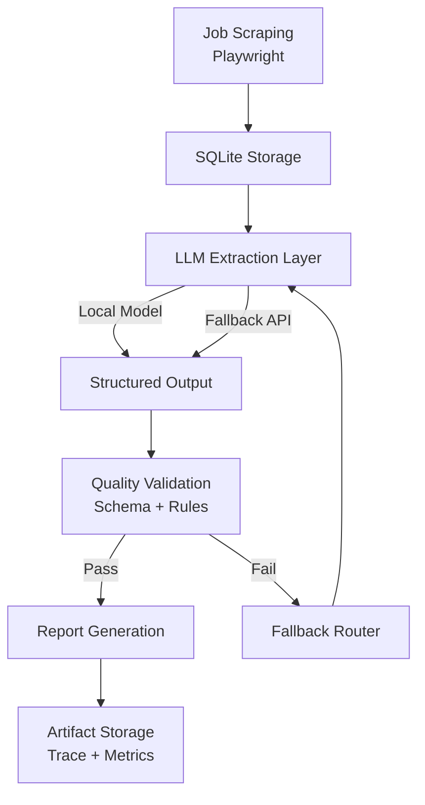

# JobPulse

> **Local-first LLM job intelligence pipeline with structured validation, deterministic fallback orchestration, and artifact-based observability.**

JobPulse is an end-to-end LLM system that transforms raw job postings into structured intelligence and actionable reports.

The project demonstrates how to design **production-style LLM pipelines**, including:

- local-first model inference
- deterministic fallback to API providers
- structured schema validation
- artifact-based observability
- orchestration with LangGraph
- MCP tool interface for modular execution

The system is designed to mirror real industry LLM workflows where **reliability, traceability, and reproducibility** are as important as model accuracy.

------

# 🚀 What JobPulse Does

JobPulse:

- Scrapes job postings (Handshake + extensible connectors)
- Extracts structured requirements using LLMs
- Fine-tunes compact models using LoRA
- Validates structured outputs with QC gates
- Falls back across providers (Local → API)
- Generates personalized skill-gap reports
- Exposes functionality via MCP tools
- Orchestrates workflows with LangGraph

------

# 🏗 System Architecture



## 🧠 Design Principles

JobPulse follows several production-inspired LLM design patterns.

### Local-first inference

Local models are attempted first to reduce cost and latency.

```
local model → qc gate → api fallback
```

**Benefits**

- lower API costs  
- faster experimentation  
- offline capability  

---

### Provider abstraction

LLM providers are accessed through a unified interface.

Supported providers:

| Provider | Example Model |
|--------|--------|
| OpenAI | gpt-4o-mini |
| NVIDIA NIM | kimi-k2 |
| Local HF | Qwen + LoRA |

---

### Strict structured outputs

Extraction must conform to a defined schema before downstream tasks execute.

**Structured schema example**

```
role_title
company
location
requirements
responsibilities
skills
years_experience_min
```

---

### Artifact-based observability

Each pipeline run produces artifacts that enable debugging without rerunning the system.

---

# 📊 Artifacts & Observability

Artifacts are separated by subsystem.

```
data/artifacts/
  scrape/<run_id>/        # scraping pipeline runs
  mcp/<job_id>/           # MCP tool chain runs
  langgraph/<run_id>/     # LangGraph orchestration runs
```

Each run produces:

```
structured.json
qc.json
report.md
trace.json
run_summary.json
config.json
```

Example:

```
data/artifacts/langgraph/64cca8f519/10704289/
```

---

## Trace Logging

`trace.json` records step-level execution events.

Example execution path:

```
fetch_jd
 → extract_local
 → qc_validate
 → fallback_to_api
 → generate_report_api
```

Each trace event records:

- timestamp  
- step name  
- execution status  
- latency  
- fallback reason  

---

## Run Summary

`run_summary.json` aggregates run-level metrics.

Example:

```json
{
  "run_id": "64cca8f519",
  "route": "local_then_api",
  "qc_status": "pass",
  "elapsed_sec": 12.3,
  "node_ms": {
    "fetch_jd": 210,
    "extract_local": 1200,
    "extract_api": 850,
    "qc_validate": 35
  }
}
```

This design enables **post-mortem debugging and reliability analysis**.

---

# 📂 Repository Structure

```
data/
  artifacts/                # runtime artifacts

scripts/
  run_pipeline.py           # scraping pipeline
  run_one_job_mcp.py        # MCP tool chain runner
  run_graph_one.py          # LangGraph orchestration runner

src/

  connectors/               # scraping adapters

  llm/
    providers/              # API + HF inference abstraction
    json_repair.py          # robust JSON parsing

  mcp_server/
    server.py               # MCP tool server
    tools_*.py              # tool implementations

  orch/
    graph.py                # LangGraph workflow
    schema.py               # structured state contracts

  training/
    train_lora.py           # LoRA fine-tuning pipeline

  db.py                     # SQLite persistence
  report.py                 # markdown report generation

models/
  qwen2.5-0.5b-jd-lora/     # trained LoRA adapters
```

---

# ⚙️ Environment Setup

## Install dependencies

Project uses **uv** for dependency management. You can install **uv** from [uv installation](https://docs.astral.sh/uv/getting-started/installation/)

```
uv sync
```

---

## Install Playwright browsers

```
python -m playwright install --with-deps
```

Without this step scraping will fail.

---

## Set API keys (optional)

```
export OPENAI_API_KEY=your_key
export NVIDIA_API_KEY=your_key
```

Local-only workflows do not require API keys.

---

# 🚀 Typical Workflow

## 1️⃣ Scrape Job Postings

```
uv run python scripts/run_pipeline.py --pages 1 --limit 10
```

Outputs:

```
data/db/jobs.db
data/artifacts/scrape/<run_id>/
```

---

## 2️⃣ Run MCP Tool Chain

```
uv run python scripts/run_one_job_mcp.py \
  --job-id 10704289 \
  --provider openai
```

Artifacts:

```
data/artifacts/mcp/<job_id>/
```

---

## 3️⃣ Run LangGraph Orchestration

```
uv run python scripts/run_graph_one.py \
  --job-id 10704289 \
  --local-first \
  --local-model Qwen/Qwen2.5-3B-Instruct \
  --extract-provider openai \
  --report-provider openai
```

Artifacts:

```
data/artifacts/langgraph/<run_id>/<job_id>/
```

---

# 🧠 LoRA Fine-Tuning

JobPulse includes a LoRA pipeline for improving structured extraction.

Dataset:

```
src/training/datasets/
  jd_struct_train.jsonl
  jd_struct_val.jsonl
```

Generated using teacher-model supervision.

Train:

```
uv run python src/training/train_lora.py
```

Output:

```
models/qwen2.5-0.5b-jd-lora/
```

---

# 📄 Example Skill-Gap Report

Example output:

```
### Role: Machine Learning Engineer

Required Skills
- Python
- PyTorch
- Distributed Training
- Data Pipelines

Candidate Skill Gap
- Distributed Training
- MLOps Infrastructure

Suggested Learning Focus
- Ray / Spark distributed systems
- Model deployment pipelines
```

---

# 🛠 MCP Tool Server

Start manually:

```
python -m src.mcp_server.server
```

Available tools:

```
fetch_jd
extract_local
extract_api
qc_validate
generate_report_api
```

This allows integration with agents, orchestration frameworks, or external pipelines.

---

# 🛡 Reliability Strategy

JobPulse implements reliability patterns commonly used in production LLM systems.

## Local-First Extraction

```
local → qc_fail → api → qc_pass → report
```

---

## QC Validation Gate

Extraction must pass validation before report generation.

Checks include:

- required fields present  
- non-empty critical fields  
- JSON integrity  

---

## JSON Hardening

LLM outputs are sanitized using:

- code fence stripping  
- bracket repair  
- JSON tail extraction  
- balanced truncation  

This significantly reduces malformed output failures.

---

# 🧩 Tech Stack

Core technologies:

- Python
- PyTorch
- HuggingFace Transformers
- PEFT (LoRA / QLoRA)
- LangGraph
- MCP
- Playwright
- SQLite

---

# 🎯 Engineering Highlights

This project demonstrates:

- production-style LLM pipeline architecture
- provider-agnostic inference layer
- local-first routing strategy
- structured schema validation
- artifact-based observability
- LangGraph orchestration
- LoRA fine-tuning workflows
- MCP tool interface design

The architecture mirrors patterns used in modern AI infrastructure systems.

---

# 🔮 Future Improvements

Planned extensions include:

- batch graph runner for large datasets
- structured extraction evaluation dashboard
- resume ingestion + skill-gap matching
- asynchronous scraping pipeline
- Dockerized deployment
- monitoring and metrics layer

---

# ⭐ Project Focus

This repository focuses on **LLM systems engineering**, not just prompt usage.

Key themes include:

- reliability
- reproducibility
- observability
- orchestration

These are critical capabilities for building real-world AI applications.