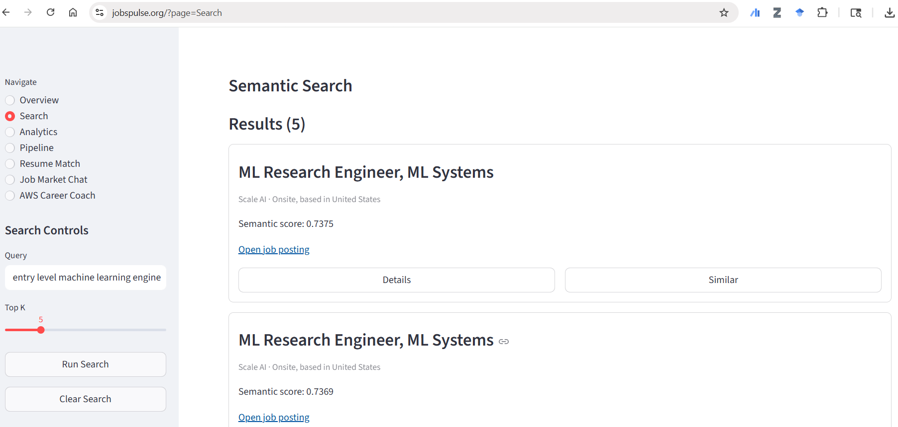
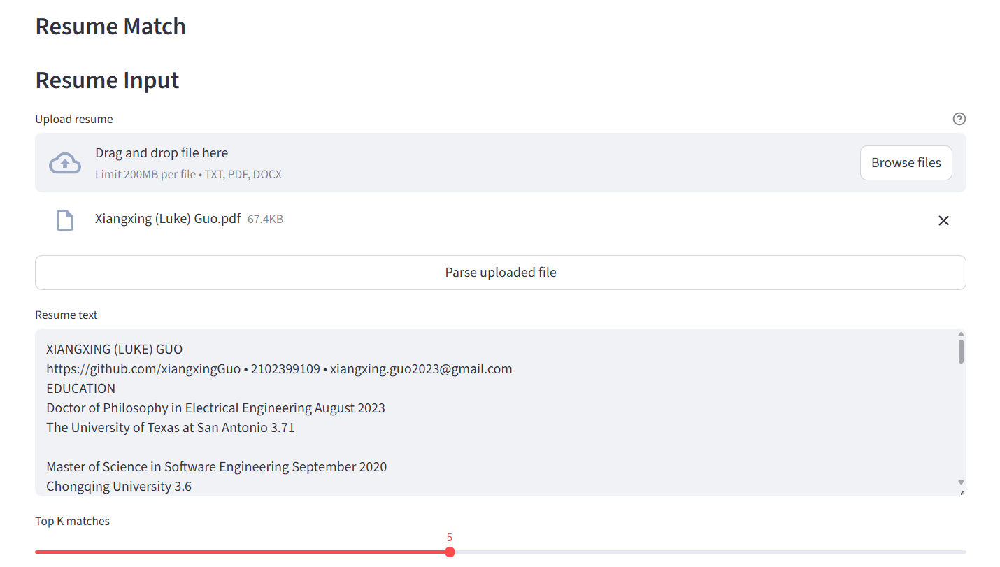
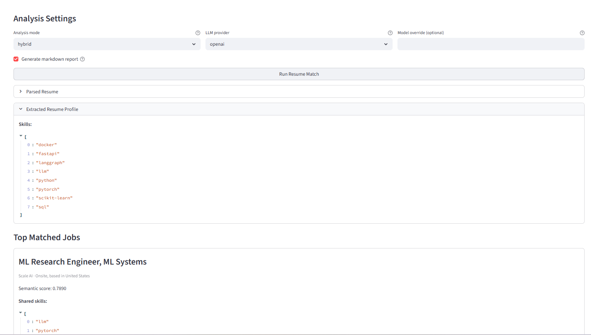
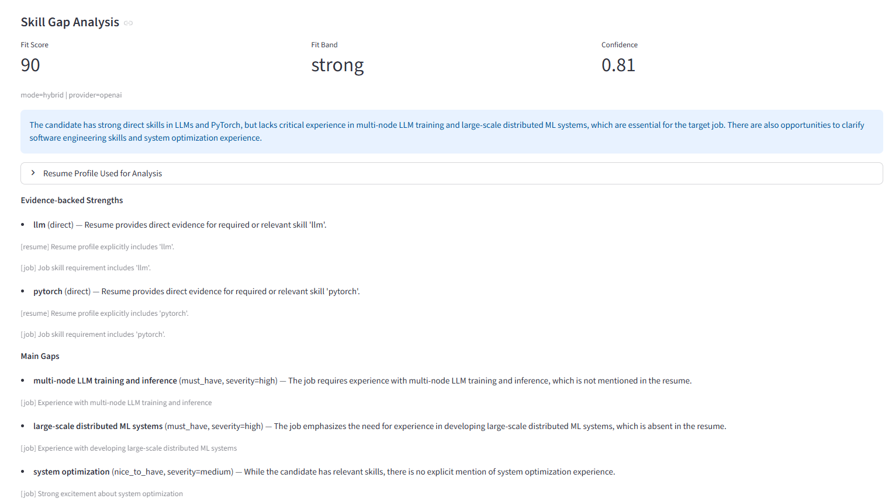
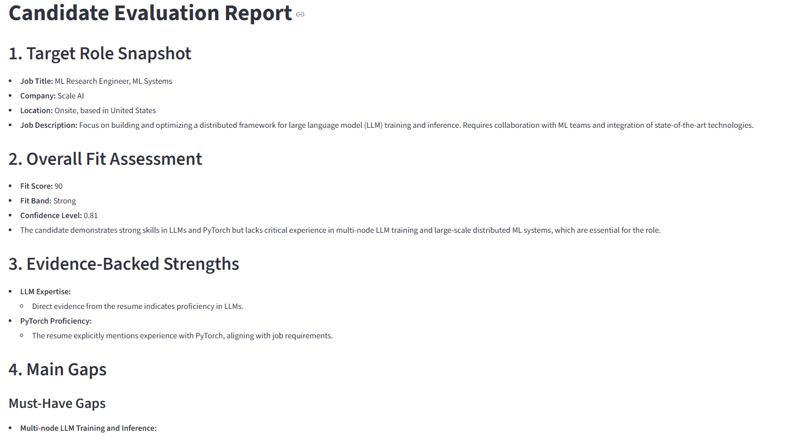
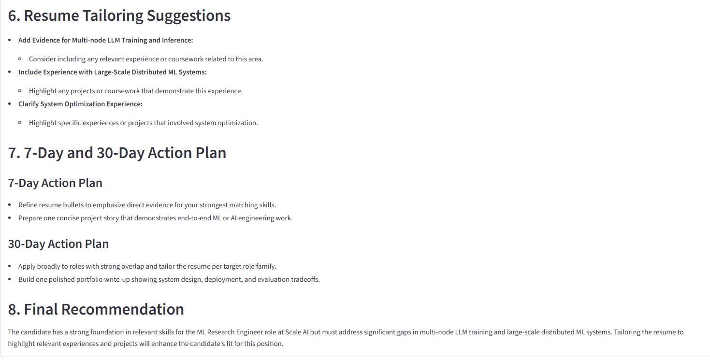
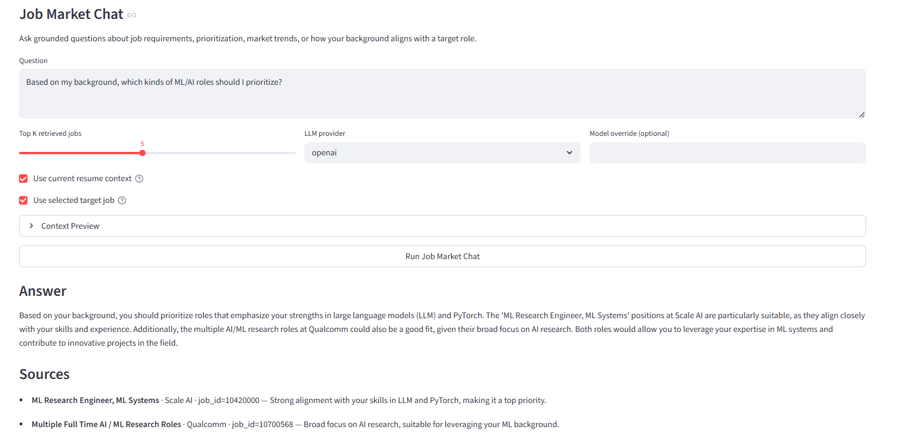
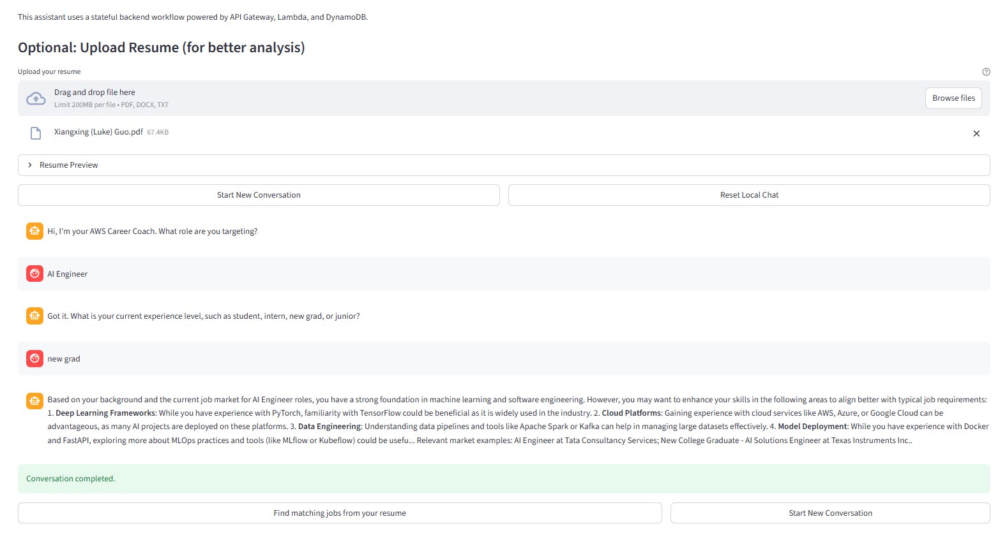
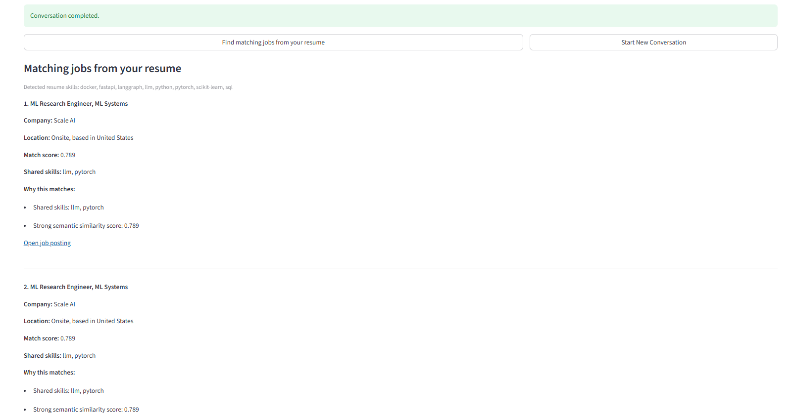
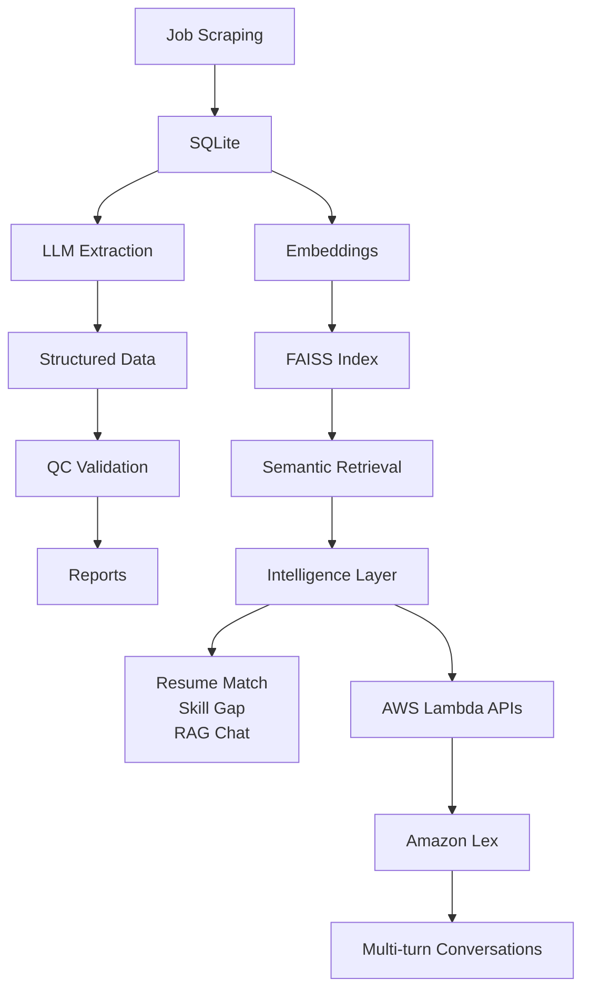

# JobPulse

> From raw job postings → structured intelligence → personalized career decisions.

JobPulse is a **production-grade AI system** that combines:

- LLM pipelines
- Retrieval-Augmented Generation (RAG)
- Cloud-native backend services
- Conversational AI (AWS Lex)

to build an **intelligent career decision platform**.

---

# 🔥 Features

- 🔍 Semantic Job Search (RAG-powered with FAISS)
- 📄 Resume → Job Matching (with explainable reasoning)
- 🧠 Skill Gap Analysis (actionable recommendations)
- 💬 Conversational Career Assistant (multi-turn dialogue via Amazon Lex)
- ☁️ Serverless AI APIs (AWS Lambda + API Gateway)
- 🔘 One-click "Find matching jobs from your resume"

---

# 🌐 Live Demo

👉 https://jobspulse.org/

**Status:** Auto-updating every 6 hours  
**Stack:** Full pipeline + RAG + UI + Cloud Integration

---

# 📸 Product Preview

## 🔍 Job Search (RAG)



---

## 📄 Resume Matching





---

## 🧠 Skill Gap Analysis



---

## One Ture Job Market Chat (OpenAI)


## 💬 Conversational AI (Amazon Lex)




### Extra Features

---

# 🧪 Example: Resume → Job Matching

**Input Resume (summary):**

- Python, SQL, ML basics  
- 2 years experience  

**Output:**

Top Matches:

- ML Engineer (78%)
- Data Analyst (72%)

Missing Skills:

- Deep Learning
- System Design

Reasoning:

- Strong data background but lacks production ML experience

---

# 🏗 System Architecture



---

# ☁️ Cloud Architecture (AWS)

```
User (Web / Chatbot)
→ Amazon Lex
→ API Gateway
→ AWS Lambda
→ RAG + Matching + Skill Gap services
→ FAISS / SQLite
```

---

# 🧠 Core Capabilities

## 1. LLM Structured Extraction

```
raw job description
→ LLM
→ structured schema
→ QC validation
```

---

## 2. Retrieval-Augmented Generation (RAG)

```
query
→ embeddings
→ FAISS
→ retrieved context
→ LLM reasoning
```

---

## 3. Resume Intelligence

```
resume
→ skill extraction
→ vector search
→ ranking + reasoning
```

---

## 4. Conversational AI (Amazon Lex)

```
user input
→ intent recognition
→ Lambda backend
→ RAG + reasoning
→ contextual response
```

Supports:

- multi-turn dialogue
- context-aware responses
- career guidance workflows

---

# ⚙️ Pipeline (Automated)

Runs every 6 hours:

```
scrape jobs
→ extract structure
→ validate
→ build embeddings
→ update FAISS
```

---

# 🛡 Reliability Design

- Local-first LLM inference
- automatic API fallback
- schema validation (QC gate)
- JSON repair pipeline

---

# 📊 Observability

Each run produces:

- structured.json
- qc.json
- trace.json
- report.md

Stored in:

```
data/artifacts/
```

---

# 🧩 Tech Stack

**AI / ML:**

- LLM (local + API)
- HuggingFace + LoRA
- RAG pipeline

**Retrieval:**

- FAISS
- embeddings

**Backend:**

- FastAPI
- AWS Lambda
- API Gateway

**Conversational AI:**

- Amazon Lex (multi-turn dialogue)

**Data:**

- SQLite
- DynamoDB

**Infra:**

- Docker

---

# 🚀 How to Run

```bash
uv sync
python -m playwright install --with-deps
uv run python scripts/run_pipeline.py
uv run python scripts/build_vector_index.py
```

---

# 🆕 Recent Updates

- Integrated AWS Lambda for serverless AI APIs
- Added Amazon Lex multi-turn conversational interface
- Enabled resume → job matching via chatbot interaction

---

# 🎯 Why This Project Matters

Most systems stop at:

> “Here are some jobs.”

JobPulse goes further:

- understands jobs
- understands candidates
- reasons about alignment

→ turning data into **decisions**

---

# ⭐ Final Takeaway

JobPulse is:

> **A full-stack AI + cloud system combining RAG, serverless architecture, and conversational AI**